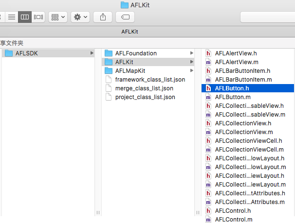

### 名称

create_sdk_base_class.py

### 功能

用于为工程创建自定义 SDK 基类库

### 介绍

* 首先遍历 Xcode 对应目中下系统 SDK，获取全部系统 SDK 类定义信息；
* 再遍历工程目录下代码，获取工程类定义信息；
* 将工程中直接继承自系统 SDK 基类的类信息获取出来；
* 针对已获取类列表，生成指定前缀和目录分组的自定义 SDK 基类库。

### 使用

```shell
usage:

$ python create_sdk_base_class.py -p AFL

-p <required : prefix name>
-s <optional : sdk name, default is "prefix name + SDK" >
-i <optional : input project path, default is current folder>
-f <optional : sdk folder path, default is current folder>
```

