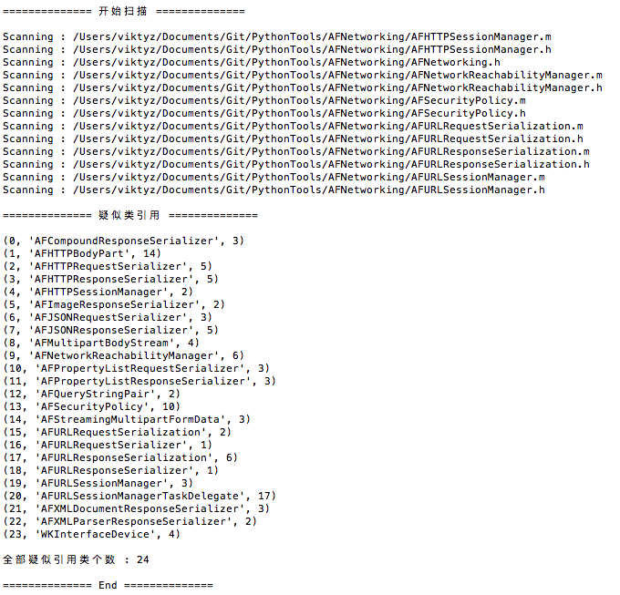

### 名称

* scan_all_class_reference.py

### 功能

* 统计目录下全部 Objective-C 文件疑似类引用信息

### 介绍

* 遍历对应目录中下全部 .h .m 文件；
* 识别 interface 、 implement 、 protocol 中全部疑似类引用；
* 输出全部类引用列表。

### 依赖

* [la_oc_code.py](https://github.com/viktyz/PythonTools/tree/master/la_oc_code) : 简单的 Objective-C 代码文件词法分析器

### 使用

```shell
usage:

$ python scan_all_class_reference.py -i project_path

-i <optional : input project path, default is current folder>
```

