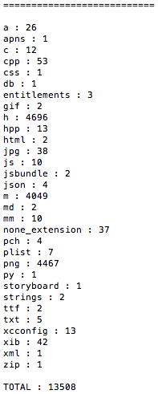
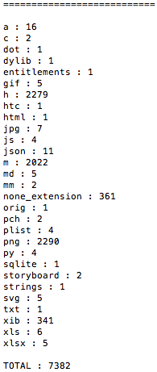

### 名称

scan_all_files_in_project.py

### 功能

* 统计目录下全部后缀文件数量与文件总数量并输出重复文件的路径

### 介绍

* 遍历 Xcode 对应工程目录中下全部文件；
* 按照文件后缀进行筛选和分组；
* 输出各后缀文件数量和文件总数量；
* 已排除以下后缀文件及文件目录下文件。

```python
['.git', 'build', '.framework', '.bundle', '.xcodeproj']
```

### 使用

```shell
usage:

$ python scan_all_files_in_project.py -i project_path

-i <optional : input project path, default is current folder>
```


