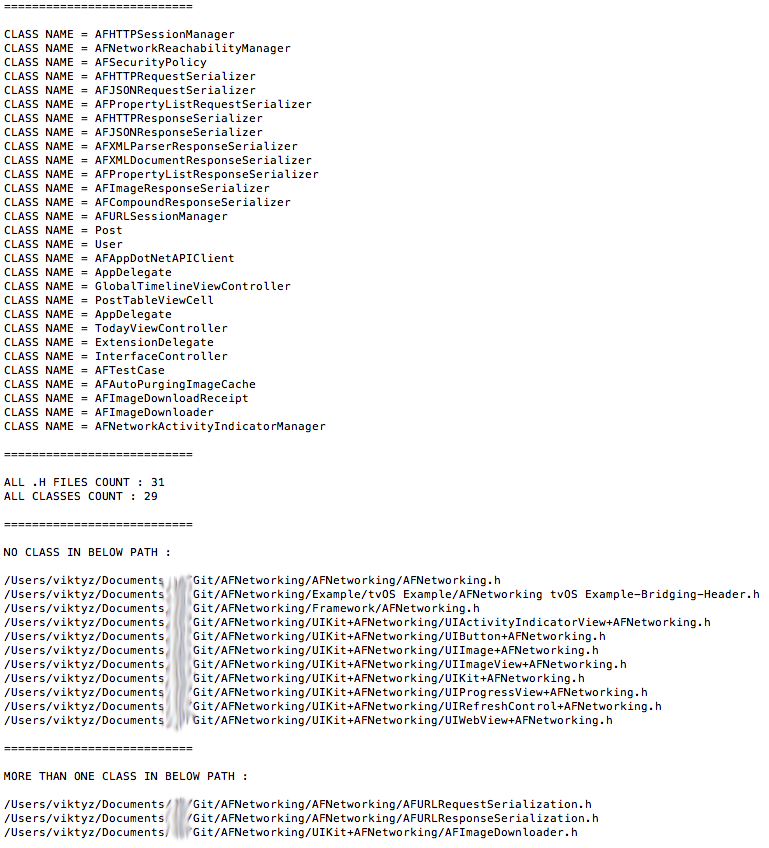

### 名称

scan_class_name.py

### 功能

* 遍历获取全部 .h 文件，并打印出全部 class 列表

### 介绍

* 遍历 Xcode 对应工程目录中下全部文件；
* 识别 .h 结尾文件并扫描获取 class 信息；
* 输出 class 名称列表和总数量；
* 输出未定义 class 的 .h 文件和定义多个 class 的 .h 文件列表信息。

### 使用

```shell
usage:

$ python scan_all_files_in_project.py -i project_path

-i <optional : input project path, default is current folder>
```

